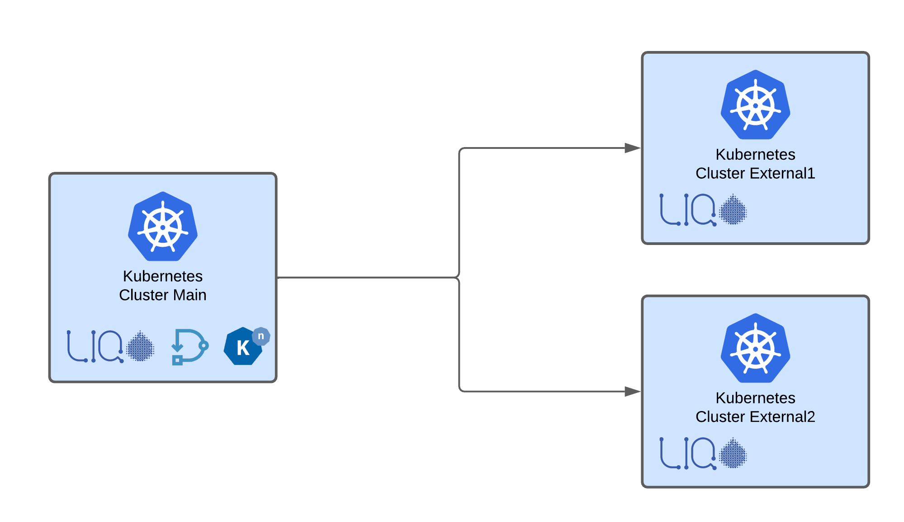
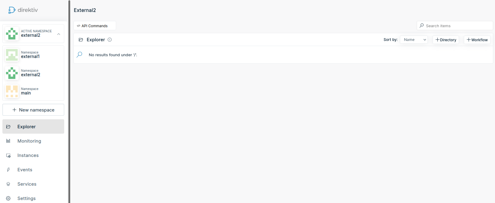

# Knative across Multiple Kubernetes Clusters with Liqo and Direktiv

[Direktiv](https://github.com/direktiv/direktiv)
[Liqo](https://liqo.io/)
[Knative](https://knative.dev/docs/serving/)


In the past few months, a few projects have started to provide a multi-cluster solution for Kubernetes. Load can be shared across different clusters or workloads can run on specific clusters. Here we will use [Liqo](https://liqo.io/) to run [Knative](https://knative.dev/docs/serving/) serverless pods on completely separated Kubernetes clusters.

To give it a real life use-case we will use [Direktiv](https://github.com/direktiv/direktiv) to deploy [Knative](https://knative.dev/docs/serving/) services in this multi-cluster setup. Direktiv is a serverless workflow and container orchestration engine which makes it the perfect candidate to run in this type of environment. 

[Direktiv](https://github.com/direktiv/direktiv) is employing namespaces to split teams or clients from each other, which isn't the same as Kubernetes namespaces. We'll deploy [Direktiv](https://github.com/direktiv/direktiv) on the primary cluster and the Knative functions within Direktiv flows on separate Kubernetes clusters. The following diagram shows the setup we are going to use. 

<p style="align: center">

</p>

## Connect Clusters

The first step is to set up the primary cluster. The main cluster, as the name implies, houses Direktiv. The offloading clusters, on the other hand, will be where the  Direktiv functions are executed. We'll call one of them "external1" and the other "external2."

Setting up Liqo is quite simple if the clusters are on the same network, but it is feasible to run it across cloud boundaries, for example between AWS and Azure or between clusters within one cloud provider. For the installation on the three clusters we are using [liqoctl](https://doc.liqo.io/usage/liqoctl/) a handy tool for installation. 

We're now getting started by configuring the core server. We must configure two Kubernetes namespaces in order to work with Liqo. The first is *direktiv*, which houses Direktiv's engine, and the second is *direktiv-services-direktiv*, where Knative pods are running. In a normal setup they would run all on the same cluster but here we need to distribute the pods via labels. 

```console
# label main node
kc label node main-server direktiv.io/namespace=main

# install liqo on main cluster
liqoctl install k3s --cluster-name=main --cluster-labels direktiv.io/namespace=main
```

The first two lines create an label, and the second one installs Liqo on the master node. If the main cluster has many nodes, they should all be labelled like the preceding example if they are intended to run Knative Pods. The following commands install Liqo on external nodes. It is important to label them during installation as seen with the *--cluster-labels* argument. 

```console
# command for cluster 1
liqoctl install k3s --cluster-name=external1 --cluster-labels direktiv.io/namespace=external1

# command for cluster 2
liqoctl install k3s --cluster-name=external2 --cluster-labels direktiv.io/namespace=external2

* Initializing installer... 🔌 
* Retrieving cluster configuration from cluster provider... 📜  
* Installing or Upgrading Liqo... (this may take few minutes) ⏳ 
* All Set! You can use Liqo now! 🚀

Use this command on a DIFFERENT cluster to enable an outgoing peering WITH THE CURRENT cluster 🛠:

liqoctl add cluster external2 --auth-url https://192.168.0.33:32194 --id 1f765d59-7883-4cbd-96f1-d28965628055 --token 574b29b0df272d3bb40e360769635c13b8942e2a39ddcce74a1c41619ac514c01b2eee69c9af7a5009fa5e03bf3df2860e22f6243a288c1f9a2761f7ddbfece5

```

We'll run these commands on external clusters, and those commands will generate a command that can be used to connect all of them. The generated command from both clusters must be carried out on the main cluster. After following these steps the main cluster should see the externals as nodes. Each node is labeled with a differnet value for *direktiv.io/namespace*, in this case *main*, *external1* and *external2*. 

```
NAME                                        STATUS   ROLES                  AGE   VERSION
main-server                                 Ready    control-plane,master   28m   v1.22.6+k3s1
liqo-af58bb84-f069-424b-bf6d-fb574f5e15ab   Ready    agent                  4s    v1.22.6+k3s1
liqo-1f765d59-7883-4cbd-96f1-d28965628055   Ready    agent                  4s    v1.22.6+k3s1
```

## Direktiv

Direktiv is installed on the main cluster and the first step is to "clone" the services across the different clusters so when the external clusters respond to Direktiv they are getting routed via Liqo's networking back across cluster boundaries. For the Direktiv namespace we want to stay on the main cluster with our pods. Only the services need to be replicated. Liqo uses [namepsace offloading](https://doc.liqo.io/usage/namespace_offloading/) for this.

```yaml
apiVersion: offloading.liqo.io/v1alpha1
kind: NamespaceOffloading
metadata:
  name: offloading
  namespace: direktiv
spec:
  namespaceMappingStrategy: EnforceSameName
  podOffloadingStrategy: Local
```

The above yaml create as a offloading rule for the namespace *direktiv*. Because Kubernetes DNS resolution includes the namespace, e.g. myservice.mynamspace, we chose *EnforceSameName* as strategy. That means the namespace is getting created with the exact same name on the external clusters. This has to be configured BEFORE enabling the namespace for offloading, so after that we enable offloading for that namespace with labeling it. After running this command all three clusters should have a namespace *direktiv* but only the main cluster runs the pods. 

```
kubectl label namespace direktiv liqo.io/enabled=true
```

The offload configuration for the Knative functions has different settings. First of all it use the strategy "LocalAndRemote" which means it can run pods locally or on the external clusters and it can run on all nodes with the *liqo.io/type* label. 

```yaml
apiVersion: offloading.liqo.io/v1alpha1
kind: NamespaceOffloading
metadata:
  name: offloading
  namespace: direktiv-services-direktiv
spec:
  namespaceMappingStrategy: DefaultName
  podOffloadingStrategy: LocalAndRemote
  clusterSelector:
    nodeSelectorTerms:
    - matchExpressions:
      - key: liqo.io/type
        operator: In
        values:
        - virtual-node
```

All clusters now have a *direktiv* namespace and external clusters have a namespace like *direktiv-services-direktiv-0bb80ef1-6e03-4542-818b-...* which is basicaly the "extension" of the main cluster. It will be activated with *kubectl label namespace direktiv-services-direktiv liqo.io/enabled=true* the same way like the direktiv namespace.

Additionally Direktiv had been setup to add node affinities to each Knative function. This schedules the pod on the labeled clusters. Functions used in Direktiv namespace *main* run on the main cluster where "external1" and "external2" run on different clusters.

```yaml
requiredDuringSchedulingIgnoredDuringExecution:
              nodeSelectorTerms:
              - matchExpressions:
                - key: direktiv.io/namespace
                  operator: In
                  values:
                  - DIREKTIV_NAMESPACE_OF_THE_POD
```

<p style="align: center">

</p>

## Running Workflows

If a function aka Knative service is getting executed in Direktiv it will now look for a node labeled with the Direktiv namespace. It will schedule the pod on that node. With Liqo it makes no difference if it is an external cluster or an internal node. It will follow the scheduling configuration.